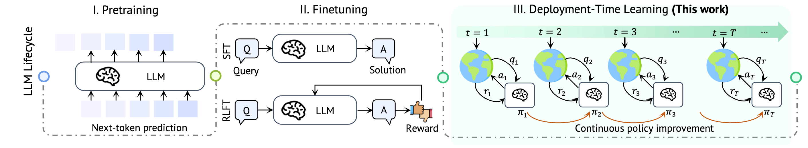
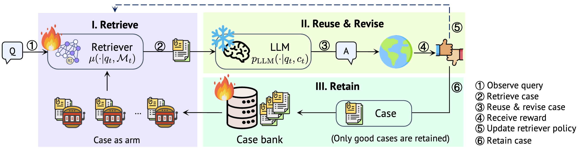

# CASCADE：面向大语言模型部署阶段的基于案例的持续适应

<p align="center">
<a href="https://huggingface.co/datasets/guosy/DTLBench">
🤗 DTLBench
</a> |
<a href="https://physionet.org/content/mimic-iv-ext-dtlbench/1.0.0/">
🫀 DTLBench（即将发布）
</a> |
<a href="https://arxiv.org/abs/xxxx">
📄 论文（即将发布）
</a>
</p>

<p align="center">
<a href="README.MD">English</a> | <strong>中文</strong>
</p>

<p align="center">
<a href="#最新动态">最新动态</a> |
<a href="#快速开始">快速开始</a> |
<a href="#资源下载">资源下载</a> |
<a href="#实验复现">实验复现</a> |
<a href="#通过-cascade-自定义部署时学习环境">自定义环境</a> |
<a href="#代码结构">代码结构</a>
</p>

<table>
<tr><td>
<p align="center">
  
</p>
<p align="left"><sub><b>大语言模型生命周期。</b> 在第一阶段，大语言模型通过大规模语料上的下一个词元预测任务进行预训练。随后，大语言模型通过有监督微调和强化学习微调进一步对齐并增强推理能力。我们关注部署时学习，将其视为第三阶段：模型在部署过程中通过在线交互持续积累经验、改进策略，而无需更新底层大语言模型参数。</sub></p>
</td></tr>
</table>

<table>
<tr><td>
<p align="center">
  
</p>
<p align="left"><sub><b>CASCADE总览。</b> 给定一个查询，CASCADE通过上下文赌博机算法检索案例，并基于案例进行复用与修正来生成解答，然后接收奖励信号。随后，检索策略会据此更新，成功案例也会被保留到案例库中。</sub></p>
</td></tr>
</table>

<a id="最新动态"></a>
## What's New

- `2026-04-28`：CASCADE正式开源。

<a id="快速开始"></a>
## 快速开始

在DTLBench上运行CASCADE，最小步骤如下：

1. 配置Python环境
2. 下载DTLBench
3. 使用支持的环境和模型后端运行`main.py`

### 1. 配置环境

```bash
cd CASCADE
conda create -n cascade python=3.10
conda activate cascade

# 安装 torch
pip install torch==2.7.1 torchvision==0.22.1 torchaudio==2.7.1 --index-url https://download.pytorch.org/whl/cu118

# 可选：安装 flash-attn（仅 REINFORCE+LoRA baseline 需要）
# pip install https://github.com/Dao-AILab/flash-attention/releases/download/v2.7.4.post1/flash_attn-2.7.4.post1+cu12torch2.7cxx11abiTRUE-cp310-cp310-linux_x86_64.whl

pip install -r requirements.txt
```

### 2. 下载DTLBench

对于已开源的数据，你可以直接从 <a href="https://huggingface.co/datasets/guosy/DTLBench">
🤗 Huggingface datasets
</a> 手动下载，或者使用下面的命令：

```bash
cd CASCADE
mkdir -p data
huggingface-cli download --repo-type dataset --resume-download guosy/DTLBench --local-dir data
```

对于受限许可的数据，请在完成 PhysioNet 要求的训练后手动下载。**注意：** 由于 PhysioNet 的政策限制，相关数据集将在论文发布后开放。

### 3. 运行CASCADE

一个最小的 `vllm` 示例（本地部署模型）如下：

```bash
python main.py \
  --seed 0 \
  --env ddxplus \
  --agent cbr \
  --bandit NeuralLinLogUCB \
  --llm qwen3-32b \
  --serving_mode vllm \
  --server <YOUR_vLLM_SERVER_IP> \
  --port <YOUR_vLLM_PORT> \
  --learning_rate 1e-5 \
  --nu 0.1
```

一个最小的`openai` 示例（兼容OpenAI的API后端）如下：

```bash
python main.py \
  --seed 0 \
  --env ddxplus \
  --agent cbr \
  --bandit NeuralLinLogUCB \
  --llm gemini-2.0-flash \
  --serving_mode openai \
  --learning_rate 1e-5 \
  --nu 0.1
```

重要参数包括：

- `--env`：要运行的 DTLBench 任务，例如 `ddxplus`、`spider`、`bird`、`banking77`、`sentifin`（请参考[env/__init__.py](env/__init__.py)中的注册环境名）
- `--agent`：部署时学习方法；运行CASCADE时使用 `cbr`
- `--bandit`：用于案例排序的上下文赌博机算法；CASCADE使用 `NeuralLinLogUCB`
- `--llm`：传给后端的模型名称
- `--serving_mode`：选择`openai`（API兼容服务）或 `vllm`（本地服务）
- `--server`：vLLM 服务地址
- `--port`：vLLM 服务端口
- `--learning_rate`：奖励模型训练的学习率
- `--nu`：上下文赌博机算法中的探索系数

<a id="资源下载"></a>
## 资源下载

这一节只对部分任务是必须的。如果你运行的是 `ddxplus`、`banking77`、`sentifin` 等任务，则不需要下面的额外资源。

部分 DTLBench 任务需要下载额外资源文件：

1. **BIRD**：从 [https://bird-bench.oss-cn-beijing.aliyuncs.com/dev.zip](https://bird-bench.oss-cn-beijing.aliyuncs.com/dev.zip) 下载资源文件并保存到 `data/bird/source/`。解压后，如果压缩包内部还有嵌套 zip，请继续递归解压，直到不再存在 zip 文件。

2. **SPIDER**：从 [https://drive.google.com/file/d/1403EGqzIDoHMdQF4c9Bkyl7dZLZ5Wt6J/view?usp=sharing](https://drive.google.com/file/d/1403EGqzIDoHMdQF4c9Bkyl7dZLZ5Wt6J/view?usp=sharing) 下载资源文件并保存到 `data/spider/source/`。解压后，只保留 `test_tables.json`、`test.json` 以及 `test_database` 中的所有文件夹。

3. **MIMIC-III (EHR)**：从 [https://drive.google.com/file/d/1diCy549_IM-iXmXdhLEiDfv-X44-2ewz/view?usp=sharing](https://drive.google.com/file/d/1diCy549_IM-iXmXdhLEiDfv-X44-2ewz/view?usp=sharing) 下载资源文件并保存到 `data/ehr/source/`，然后解压。

4. **2wiki**：使用提供的脚本下载源文件。由于文件较大，下载过程可能较久。

```bash
cd data/2wiki
bash download.sh ./source
```

<a id="实验复现"></a>
## 实验复现

仓库中已经提供了论文主要实验所需的脚本。

如果你要本地部署 Qwen 模型，请参考 `scripts` 目录中的 `serve_qwen_4b.sh`、`serve_qwen_8b.sh`、`serve_qwen_14b.sh`、`serve_qwen_32b.sh`、`serve_qwen_30b.sh`。

Fig. 3 中的单轮环境结果请参考 `scripts/single_turn_experiments.sh`。

Fig. 5 中的多轮仿真环境结果请参考 `scripts/multi_turn_experiments.sh`。

Fig. 6 中的多轮真实世界环境结果请参考 `scripts/real_world_experiments.sh`。

Fig. 4 中的大语言模型可扩展性结果请参考 `scripts/white_box_experiments.sh` 和 `scripts/black_box_experiments.sh`。

<a id="通过-cascade-自定义部署时学习环境"></a>
## 通过 CASCADE 自定义部署时学习环境

如果你想把自己的任务接入 CASCADE，最简单的方式是参考 [env/base.py](env/base.py) 以及现有单轮环境实现，例如 [env/ddxplus.py](env/ddxplus.py) 或 [env/spider.py](env/spider.py)。对于 CASCADE，本节建议的实现顺序是：

1. 新建 `env/<task>.py`
2. 新建 `env/prompts/<task>_prompt.py`
3. 在 `env/__init__.py` 中注册环境
4. 通过 `main.py` 运行

<details>
<summary><strong>1. 配置 <code>env/&lt;task&gt;.py</code></strong></summary>

这个文件是 single-turn 环境的核心。它需要继承 `Env`，并实现 CASCADE 在部署时学习过程中会调用的方法：

- `__len__()`：样本数量
- `observe()`：返回当前任务文本
- `evaluate(generated_text)`：解析模型输出并返回 `(generated_answer, reward)`
- `get_zero_shot_prompt(problem)`：在没有历史案例时构造 zero-shot prompt
- `get_case_based_prompt(problem, cases)`：在 CASCADE 检索到历史案例后构造 case-based prompt

在这个文件中，你需要完成三件事：

- 在 `init_env()` 中加载任务流
- 定义如何从模型输出中抽取最终答案
- 定义如何计算奖励

相比数据的存储格式，更重要的是每条样本暴露了哪些字段。对大多数任务来说，一条样本至少应包含：

- `task`：用于构造提示词和检索的任务文本
- 用于评测的监督信号，通常存放在 `label`

如果任务还需要额外上下文，例如 schema、标签空间、API 文档或业务规则，可以直接作为样本字段存储，并在构造 prompt 时注入。

一个最小环境示例如下：

```python
import json
from .base import Env
from .prompts.my_task_prompt import ZERO_SHOT_PROMPT, CASE_PROMPT, CBR_PROMPT

class MyTaskEnv(Env):
    def __init__(self):
        super().__init__()
        self.dataset = []
        self.init_env()
        self.ZERO_SHOT_PROMPT = ZERO_SHOT_PROMPT
        self.CASE_PROMPT = CASE_PROMPT
        self.CBR_PROMPT = CBR_PROMPT

    def init_env(self):
        with open("data/my_task/my_task.jsonl", encoding="utf-8") as file:
            for line in file:
                self.dataset.append(json.loads(line))

    def __len__(self):
        return len(self.dataset)

    def observe(self):
        return self.dataset[self.index]["task"]

    def evaluate(self, generated_text):
        generated_answer = self.extraction(generated_text)
        reward = self.reward_function(generated_answer)
        return generated_answer, reward

    def get_zero_shot_prompt(self, problem):
        return self.ZERO_SHOT_PROMPT.format(task=problem)

    def get_case_based_prompt(self, problem, cases):
        case_prompt = ""
        for case in cases:
            case_prompt += self.CASE_PROMPT.format(task=case["task"], answer=case["answer"])
        return self.CBR_PROMPT.format(case_prompt=case_prompt, task=problem)

    def extraction(self, generated_text):
        return generated_text.strip()

    def reward_function(self, generated_answer):
        ground_truth = self.dataset[self.index]["label"]
        return int(generated_answer == ground_truth)
```

`evaluate()` 的关键是，它需要包含 CASCADE 所需的两个步骤：

- `extraction(generated_text)`：从原始输出中提取最终答案
- `reward_function(generated_answer)`：与真值比较，并返回 `0` 或 `1`

</details>

<details>
<summary><strong>2. 配置 <code>env/prompts/&lt;task&gt;_prompt.py</code></strong></summary>

对于 CASCADE，prompt 文件只需要三个模板：

- `ZERO_SHOT_PROMPT`
- `CASE_PROMPT`
- `CBR_PROMPT`

它们的作用分别是：

- `ZERO_SHOT_PROMPT`：当前还没有已保存的案例时使用
- `CASE_PROMPT`：定义单条历史案例如何被序列化
- `CBR_PROMPT`：把检索到的案例和当前任务拼接成最终提示词

这些提示词应至少包含以下信息：

1. 任务指令：模型需要完成什么
2. 任务上下文：`task` 中没有但模型又必须知道的信息
3. 输出格式：一个可以被稳定解析的严格答案格式
4. 案例一致性：`CASE_PROMPT` 中的答案格式必须与当前任务期望格式一致

一个最小示例如下：

```python
CASE_PROMPT = """[Task] {task}
[Answer] {answer}
"""

CBR_PROMPT = """You are a helpful assistant for my task.

Here are some relevant cases:
{case_prompt}

Now solve the following task:
{task}

Please output the answer in the format:
<answer>
"""

ZERO_SHOT_PROMPT = """You are a helpful assistant for my task.

Now solve the following task:
{task}

Please output the answer in the format:
<answer>
"""
```

最关键的一条原则是：提示词中定义的输出格式必须与evaluation的解析格式严格一致。如果提示词要求输出 `\\boxed{answer}`，那么 `extraction()` 就应该按 `\\boxed{...}` 解析；如果任务是SQL语句生成，则提示词应该强制输出单个SQL块，而评测应基于执行结果而不是字符串完全相等。

</details>

<details>
<summary><strong>3. 在 <code>env/__init__.py</code> 中注册</strong></summary>

完成环境和prompt文件后，在 [env/__init__.py](env/__init__.py) 中注册新环境：

```python
from .my_task import MyTaskEnv

ENV_DICT = {
    # ...
    "my-task": MyTaskEnv,
}
```

</details>

<details>
<summary><strong>4. 运行 CASCADE</strong></summary>

然后通过如下命令运行：

```bash
python main.py --env my-task --agent cbr --bandit NeuralLinLogUCB --llm <model_name> --serving_mode openai
```

</details>

<details>
<summary><strong>检查清单</strong></summary>

运行前，建议确认以下五点：

1. `task` 确实是你希望 CASCADE 检索的文本
2. `ZERO_SHOT_PROMPT` 和 `CBR_PROMPT` 使用相同的答案格式
3. `CASE_PROMPT` 中保存的答案格式与推理时要求的一致
4. `extraction()` 能稳定解析该格式
5. `reward_function()` 反映了任务的真实成功标准

如果这五部分都正确，一个新的 single-turn 任务通常就可以比较顺利地接入 CASCADE。

</details>

<a id="代码结构"></a>
## 代码结构

```text
CASCADE/
├─ main.py                 # 主入口：大多数实验通过该脚本运行
├─ main_discovery.py       # supplementary notes 中 discovery mechanism 的实验
├─ main_deepsearch.py      # deep search 实验入口（需要 MCP 工具
├─ agent.py                # Agent 实现
├─ bandit.py               # Bandit policy 实现
├─ config.py               # 统一配置
├─ llm.py                  # OpenAI / vLLM 接口封装
├─ data/                   # DTLBench 数据与资源目录
├─ env/                    # DTLBench 各任务环境类与提示词文件
├─ scripts/                # vLLM 部署和实验脚本
├─ Figures/
└─ requirements.txt
```
